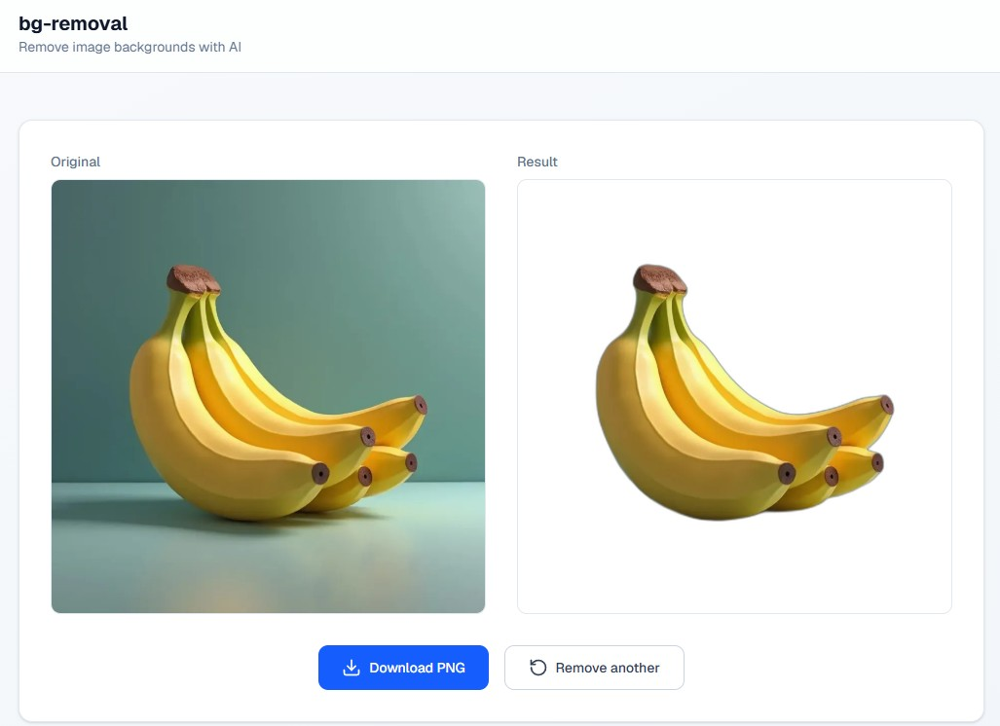

<div align="center">
  <h1>🧹 bg-removal</h1>
  <p><strong>Professional AI-powered background removal service</strong></p>
  <p>Async processing with Celery queues, FastAPI backend, and React frontend</p>

  <!-- Badges -->
  <p>
    
    
    
    
    
    
    
    
    
    
    
    
  </p>

  <p>
    <a href="https://github.com/alex-pimentel/bg-removal/actions/workflows/ci.yml"></a>
    <a href="https://github.com/alex-pimentel/bg-removal/actions/workflows/lint.yml"></a>
    <a href="https://github.com/alex-pimentel/bg-removal/actions/workflows/test.yml"></a>
    <a href="https://github.com/alex-pimentel/bg-removal/actions/workflows/security.yml"></a>
    <a href="https://github.com/alex-pimentel/bg-removal/actions/workflows/audit.yml"></a>
    <a href="https://github.com/alex-pimentel/bg-removal/actions/workflows/build.yml"></a>
  </p>
</div>

---

## 📸 Snapshot

<p align="center">
  
</p>

---

## 🚀 Features

- **AI background removal** — Powered by `rembg` with U²-Net deep learning model
- **Async task queue** — Celery + Redis for non-blocking, scalable processing
- **Real-time progress** — Frontend polls task status until completion
- **Drag & drop upload** — Modern React UI with Tailwind CSS 4
- **Before / after preview** — Side-by-side comparison with one-click download
- **Dockerized** — Multi-container setup with hot-reload in development
- **Production ready** — Nginx reverse proxy, health checks, resource limits

---

## 🏗️ Architecture

```
         ┌──────────────┐
         │  React/SPA   │
         │ :5173 (dev)  │
         └──────┬───────┘
                │ POST /api/remove-bg/
                ▼
         ┌──────────────┐
         │  FastAPI     │──── task_id ───→ ┌──────────────┐
         │  :8000       │                  │   Celery     │
         └──────┬───────┘                  │   Worker     │
                │ task → Redis             │  (rembg)     │
                ▼                          └──────┬───────┘
         ┌──────────────┐                        │ result
         │    Redis     │◄───────────────────────┘
         │  (broker)    │
         └──────┬───────┘
                │ polling: GET /api/tasks/{id}/status
                ▼
         ┌──────────────┐
         │  Frontend    │──── download: GET /api/tasks/{id}/result
         │  (preview)   │
         └──────────────┘
```

---

## 🛠️ Stack

| Layer | Technology |
|---|---|
| **API** | [FastAPI](https://fastapi.tiangolo.com/) + [Uvicorn](https://www.uvicorn.org/) |
| **Frontend** | [React 19](https://react.dev/) + [TypeScript](https://www.typescriptlang.org/) + [Vite](https://vite.dev/) |
| **UI** | [Tailwind CSS 4](https://tailwindcss.com/) + [Shadcn UI](https://ui.shadcn.com/) |
| **Queue** | [Celery](https://docs.celeryq.dev/) + [Redis](https://redis.io/) |
| **AI Model** | [rembg](https://github.com/danielgatis/rembg) (U²-Net) |
| **Container** | [Docker Compose](https://docs.docker.com/compose/) |
| **CI/CD** | [GitHub Actions](https://github.com/features/actions) |

---

## 📦 Project Structure

```
bg-removal/
├── apps/
│   ├── api/                 # FastAPI backend
│   │   ├── src/
│   │   │   ├── main.py      # App entry point with lifespan
│   │   │   ├── api/         # REST routes
│   │   │   ├── core/        # Config, Redis, Celery app
│   │   │   ├── models/      # Pydantic schemas
│   │   │   └── services/    # Background removal logic
│   │   └── tests/
│   │
│   └── web/                 # React frontend
│       └── src/
│           ├── components/  # ImageUploader, Preview, Status
│           ├── pages/       # Home page
│           ├── hooks/       # useTaskStatus polling
│           └── lib/         # API client, utils
│
├── worker/                  # Celery worker (scalable)
│   └── src/tasks/           # remove_bg task definition
│
├── docker/
│   ├── docker-compose.yml      # Development environment
│   ├── docker-compose.prod.yml # Production environment
│   └── nginx/                  # Reverse proxy config
│
├── packages/shared/         # Shared TypeScript types
├── scripts/                 # Audit & utility scripts
├── Makefile                 # dev, prod, test, lint, clean
└── .github/workflows/       # CI/CD pipelines (lint, test, security, audit, build)
```

---

## ⚡ Quick Start

```bash
# Prerequisites: Docker and Docker Compose

# Start all services
make dev

# Or explicitly:
docker compose -f docker/docker-compose.yml up --build
```

### Services

| Service | URL | Description |
|---|---|---|
| **Frontend** | http://localhost:5173 | React SPA with upload & preview |
| **API** | http://localhost:8000 | FastAPI backend |
| **API Docs** | http://localhost:8000/docs | Swagger UI |
| **Redis** | localhost:6379 | Message broker |

---

## 🔄 How it Works

1. **Upload** — Drag & drop image in the web UI → `POST /api/remove-bg/`
2. **Queue** — API enqueues a Celery task → returns `task_id` immediately
3. **Process** — Celery worker picks up the task, runs `rembg` to remove background
4. **Poll** — Frontend polls `GET /api/tasks/{id}/status` every second
5. **Download** — Once complete, preview side-by-side and download PNG

```
POST /api/remove-bg/  →  { task_id: "abc-123" }
GET  /api/tasks/abc-123/status  →  PENDING → STARTED → SUCCESS
GET  /api/tasks/abc-123/result  →  image/png (binary)
```

---

## 🧪 Commands

```bash
make dev          # Start development environment
make dev-build    # Rebuild and start
make dev-down     # Stop development
make prod         # Start production
make prod-build   # Rebuild production and start
make test         # Run API tests
make lint         # Lint backend code
make clean        # Remove all containers and volumes

make act-lint      # Simulate lint workflow locally (via act)
make act-test      # Simulate test workflow locally (Redis included)
make act-security  # Simulate security workflow locally
make act-audit     # Simulate audit workflow locally
make act-build     # Simulate build workflow locally
make act-all       # Simulate all workflows sequentially
```

---

## 🧰 Testing

```bash
# Run API tests
docker compose -f docker/docker-compose.yml exec api pytest

# Run all quality audits
bash scripts/run_all_audits.sh
```

### Local CI simulation

Requires [act](https://github.com/nektos/act) + Docker:

```bash
# Install act
curl -s https://raw.githubusercontent.com/nektos/act/master/install.sh | sudo bash -s -- -b /usr/local/bin

# Simulate a single workflow
make act-lint

# Simulate all workflows
make act-all
```

`make act-test` automatically provisions a Redis container via `services.redis` — no manual setup needed.

---

## 📈 Performance

| Metric | Value |
|---|---|
| First request (model download) | ~55s |
| Subsequent requests | ~1.6s |
| Max file size | 10MB |
| Supported formats | PNG, JPEG, WEBP |
| Queue broker | Redis |
| Task result TTL | 1 hour |

---

## 🤝 Contributing

Contributions are welcome! Please read [CONTRIBUTING.md](CONTRIBUTING.md) before submitting a pull request.

---

## ☁️ Deploy

The frontend is deployed on **Cloudflare Pages**.
[](https://pages.cloudflare.com/)
Special thanks to **Cloudflare** for the generous free tier that makes it possible to serve this project's frontend at the edge, worldwide, with zero configuration overhead.

---

## 📄 License

[MIT](LICENCE.md) © 2026

---

<div align="center">
  <sub>Built with ❤️ using FastAPI, Celery, React, and Docker</sub>
</div>
